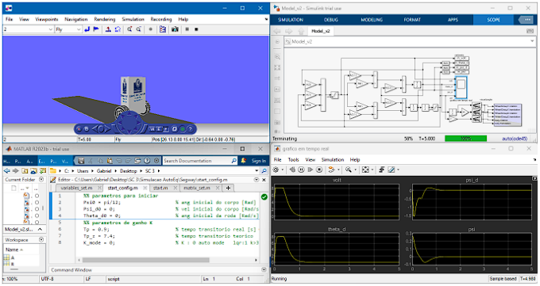

# Documento de Planejamento de Trabalho de Sistema e Controle 3
#### Objetivos do Projeto

1. Criar códigos em malha-aberta e fechada no Simulink
2. Esquemático Fritzing 
3. Simulação 3D VR - Simulink PID
4. Simulações/Códigos Matlab LQR e PID
5. Códigos Arduino - Modelo Segway PID e LQR com Filtro de Kalman
6. Slides de construção do projeto
7. Documentação Projeto

## Créditos
- **Autores**: [Gabriel Rebouças](https://github.com/gabereboucas).
